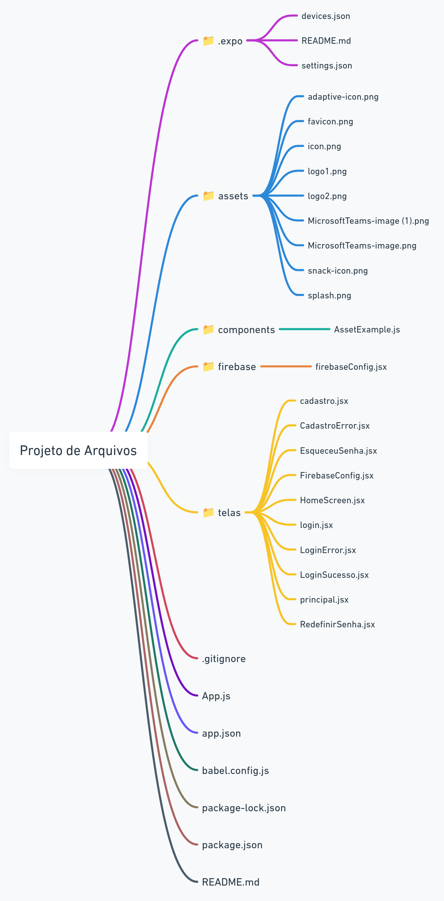

A Visionary AI é uma empresa inovadora no campo da inteligência artificial, liderada por uma equipe de sócios visionários que estão moldando o futuro da análise de mercado. Fundada por Enzo Gallone, Leonardo Scotti, Pedro Gomes, Gabriel Baltazer e Vinícius Camargo, a Visionary AI tem como missão revolucionar a maneira como as empresas interpretam e reagem às tendências de mercado.

A proposta central da Visionary AI é o desenvolvimento de uma inteligência artificial generativa de ponta, projetada para prever tendências de mercado com uma precisão sem precedentes. Esse sistema avançado vai além da simples análise de dados históricos, utilizando algoritmos sofisticados e técnicas de machine learning para criar modelos preditivos que ajudam as empresas a antecipar mudanças e se adaptar rapidamente às novas demandas.

O projeto da Visionary AI está centrado em uma plataforma de IA generativa que oferece previsões detalhadas e acionáveis sobre as tendências de mercado. Utilizando técnicas avançadas de aprendizado profundo e processamento de linguagem natural, a plataforma analisa grandes volumes de dados, identifica padrões emergentes e gera insights valiosos. Esses insights permitem que empresas de diversos setores se preparem para mudanças, aproveitem novas oportunidades e se posicionem estrategicamente no mercado.

Com a Visionary AI, as empresas não precisam mais adivinhar o futuro – podem moldá-lo com a ajuda de previsões precisas e insights poderosos. A nossa missão é capacitar nossos clientes a serem verdadeiros líderes de mercado, antecipando tendências e tomando decisões informadas que conduzam ao sucesso.

## diagrama

